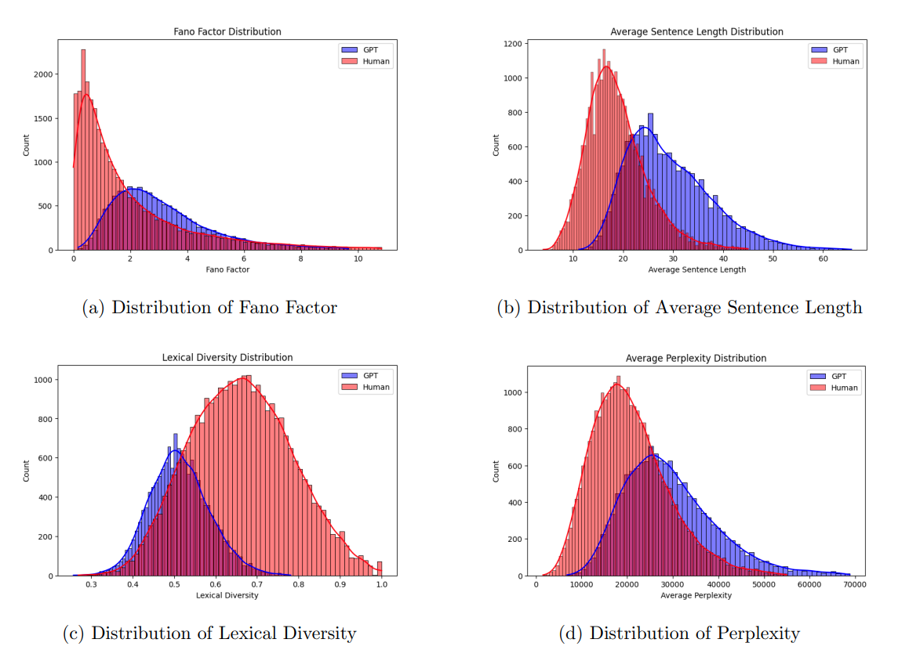

  

## Abstract
The remarkable advances in natural language processing, embodied by the advent of large language models (LLMs) like GPT-3, have brought about both promise and peril. These LLMs, with their capacity to generate impressively coherent and fluent text, empower a spectrum of applications ranging from conversational agents to creative writing aids, and productivity-boosting auto-completion programs. However, these same capabilities risk enabling malicious activities, such as mass production of synthetic disinformation, spam, and phishing content ([Solaiman et al., 2019](https://example.com/solaiman2019release), [Spitale, 2023](https://example.com/spitale2023ai), [Gradon, 2023](https://example.com/gradonm2023electric)).

Given this duality, the critical need to develop robust strategies for detecting machine-generated text is evident. This dissertation addresses this pressing challenge by focusing on linguistic techniques for distinguishing between human-written and machine-generated texts. Our investigation seeks to deepen understanding of the subtle yet distinct differences between human and LLMs writing styles, thereby enabling the identification of AI-generated content.

## Research Methods
For this research, two primary methods were developed:

1. A hand-crafted feature-based approach that applies classical machine learning algorithms to identify signals and patterns suggestive of artificially constructed text. Metrics used include perplexity, lexical diversity, average sentence length, and semantic inconsistencies, among others.

2. A deep learning-based approach based on RoBERTa leverages machine learning techniques to train models on examples of human and machine-generated texts.

## Evaluation
The techniques were evaluated using the Human ChatGPT Comparison Corpus (HC3) established by [Guo et al., 2023](https://example.com/guo2023close). This corpus consists of almost 40,000 questions and their corresponding responses from both human experts and ChatGPT (GPT-3). Additionally, the GPT-2-output-dataset [^1] provided by OpenAI was used. This dataset includes 250,000 documents from the WebText test set, as well as 250,000 random samples for each GPT-2 model.

## Findings
The findings of this research reveal several intriguing disparities between human and AI text generation. I demonstrated that these differences could be successfully utilized by classifiers to distinguish between human and AI-generated text. Both the hand-crafted feature-based approach and the RoBERTa-based deep learning approach achieved high precision and recall scores in identifying AI-generated content. These findings serve to underline the effectiveness of the developed techniques in this burgeoning field of study.

[^1]: [GPT-2 Output Dataset](https://github.com/openai/gpt-2-output-dataset)
